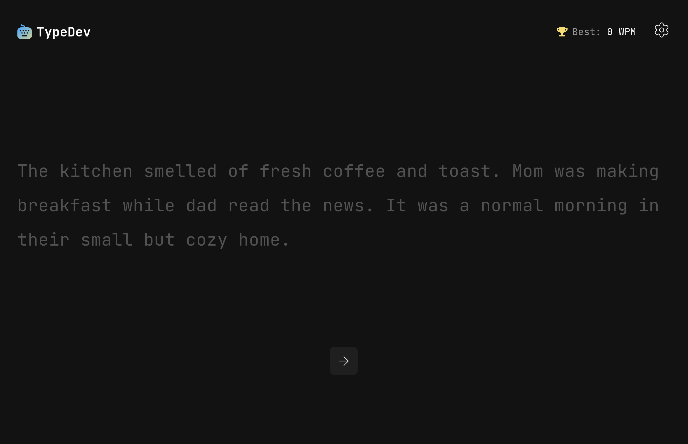

# Typing Speed Test

A responsive typing speed test application built with React and TypeScript.
It calculates words per minute (WPM), accuracy, and allows users to restart and resume tests.
This is a solution to the [Typing Speed Test challenge on Frontend Mentor](https://www.frontendmentor.io/challenges/typing-speed-test).

## Table of contents

- [Overview](#overview)
  - [The challenge](#the-challenge)
  - [Screenshot](#screenshot)
  - [Links](#links)
- [My process](#my-process)
  - [Built with](#built-with)
  - [What I learned](#what-i-learned)
  - [Continued development](#continued-development)
  - [Useful resources](#useful-resources)
- [Author](#author)

## Overview

### The challenge

Users should be able to:

- Start typing & view results showing WPM, accuracy, and resume after completing a test
- View the optimal layout for the interface depending on their device's screen size

### Screenshot



### Links

- Solution URL: [GitHub](https://github.com/Luminoso1/typing-speed-test)
- Live Site URL: [typedev](https://typedev.netlify.app/)

## My process

### Built with

- React
- TypeScript
- Tailwind CSS
- Semantic HTML5

### What I learned

- How to calculate typing accuracy based on correct characters vs total typed characters.

```ts
export const calcAccuracy = (corrects: number, total: number) => {
  if (total === 0) return 100

  const result = Math.round((corrects / total) * 100)

  return Math.max(0, result)
}
```

- How to compute WPM (Words Per Minute) using elapsed time in milliseconds.

```ts
export const calcWpm = (corrects: number, ms: number) => {
  const elapsedMinutes = ms / 60000

  if (elapsedMinutes < 1 / 60) return 0

  const result = Math.round(corrects / WPM_CHARS_PER_WORD / elapsedMinutes)

  return Math.max(0, result)
}
```

- How to implement a custom `useFocusTrap` hook to improve accessibility in modal components.

```tsx
// useFocusTrap
const handleTab = (event: KeyboardEvent) => {
  if (event.key !== 'Tab' || !containerRef.current) return

  const focusableElements =
    containerRef.current.querySelectorAll<HTMLElement>(focusableSelector)

  if (focusableElements.length === 0) {
    event.preventDefault()
  }

  const first = focusableElements[0]
  const last = focusableElements[focusableElements.length - 1]
  const activeElement = document.activeElement as HTMLElement

  if (event.shiftKey && activeElement === first) {
    event.preventDefault()
    last.focus()
  } else if (!event.shiftKey && activeElement == last) {
    event.preventDefault()
    first.focus()
  }
}
```

- How to create a smooth auto-scroll behavior using `useRef` and `scrollTo`.

```tsx
export default function useScroll(input: string, padding: number) {
  const container = useRef<HTMLDivElement>(null)
  const element = useRef<HTMLSpanElement>(null)

  useEffect(() => {
    if (!element.current || !container.current) return

    const top = element.current.offsetTop

    container.current.scrollTo({
      top: top - padding,
      behavior: 'smooth',
    })
  }, [input.length, padding])

  return { container, element }
}
```

### Continued development

- Improve accessibility (ARIA roles, screen reader support).
- Add dark/light theme toggle.
- Add persistency with local storage
- Add a leaderboard with supabase + auth
- Add additionals text (code, poems, articles)

### Useful resources

- [Focus Trap](https://css-tricks.com/a-primer-on-focus-trapping) - This helped me to learn _Focus Trap_.
- [Auto Scroll]() -

## Author

- Github - [Luminoso1](https://github.com/luminoso1)
- Frontend Mentor - [@luminoso1](https://www.frontendmentor.io/profile/luminoso1)
